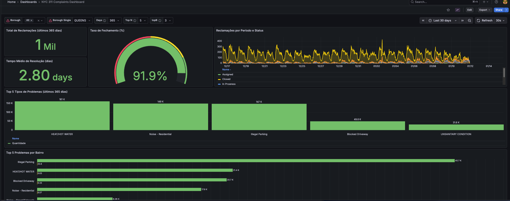

# NYC 311 Complaints

Projeto NYC 311 para análise de performance de queries e índices.

## Estrutura

```
v2/
├── docker-compose.yml      # Configuração Docker (postgres, grafana, pgadmin)
├── cli.py                  # CLI simplificado com 5 comandos
├── import_data.py          # Script de importação simplificado
├── data/                   # Arquivos CSV para importação
├── postgres/
│   ├── Dockerfile          # Imagem PostgreSQL com Python
│   └── init/               # Scripts de inicialização do banco
├── grafana/
│   └── provisioning/       # Configuração automática do Grafana
└── scripts/
    ├── create_tables.sql   # Tabelas essenciais
    ├── create_indexes.sql  # Índices para comparação de performance
    ├── queries.sql         # Queries de análise
    └── explain_analyze.sql # Queries com EXPLAIN ANALYZE
```

## Tabelas Essenciais

Apenas 4 tabelas são criadas:
- `complaints`: Tabela principal de reclamações
- `locations`: Informações geográficas (borough)
- `complaint_types`: Tipos de reclamação
- `statuses`: Status das reclamações

## Tabela Comparativa: Tabelas e Queries

| Tabela | Descrição | Queries Relacionadas |
|--------|-----------|---------------------|
| `complaints` | Tabela principal de reclamações com datas, status e tipos | Todas as queries |
| `locations` | Informações geográficas (borough, cidade, coordenadas) | Top N Problemas por Bairro, Matriz de Similaridade, Análise Estatística por Bairro |
| `complaint_types` | Tipos de reclamação | Top N Problemas por Bairro, Matriz de Similaridade, Análise por Tipo |
| `statuses` | Status das reclamações (Open, Closed, In Progress, etc.) | Reclamações por Período, Análise por Status |

### Queries Disponíveis

| Categoria | Query | Descrição |
|-----------|-------|-----------|
| **Filtros por Data** | Reclamações por Período | Filtra reclamações por intervalo de datas e agrupa por data e status |
| **Filtros por Data** | Análise Temporal | Analisa reclamações por mês/semana, status e tipo nos últimos 6 meses |
| **Agregação** | Top N Problemas por Bairro | Ranking dos top 10 problemas por bairro com proporções |
| **Agregação** | Tempo Médio de Resolução | Calcula tempo médio de resolução em dias |
| **Agregação** | Taxa de Fechamento | Calcula percentual de reclamações fechadas |
| **Junções** | Matriz de Similaridade entre Bairros | Calcula correlação de Pearson entre bairros baseado em tipos de reclamação |
| **Análise Estatística** | Estatísticas por Bairro e Tipo | Análise detalhada com medianas, percentis, rankings e categorização |
| **Análise Estatística** | Análise Agregada Completa | Análise agregada por bairro, cidade, status e tipo com múltiplas métricas |

## Comandos CLI

### Iniciar aplicação
```bash
python cli.py start
```

### Baixar dados CSV
```bash
python cli.py download
```
Baixa dados da API NYC 311 e salva em `data/{quantidade}_rows.csv`

### Importar dados
```bash
python cli.py import
```

### Testar queries com EXPLAIN ANALYZE
```bash
python cli.py test-query
```

### Resetar banco de dados
```bash
python cli.py reset
```

## URLs de Acesso

- **Grafana**: http://localhost:3031
- **pgAdmin**: http://localhost:5051
- **PostgreSQL**: localhost:5434

## Requisitos

- Docker e Docker Compose
- Python 3

## Instalação

```bash
pip install -r requirements.txt
```

## Uso

1. Inicie os containers: `python cli.py start`
2. Importe os dados: `python cli.py import`
3. Teste as queries: `python cli.py test-query`
4. Acesse o Grafana: http://localhost:3031

## Grafana
- Validar conexão com o Postgres antes de acessar o dashboard

### Dashboard

